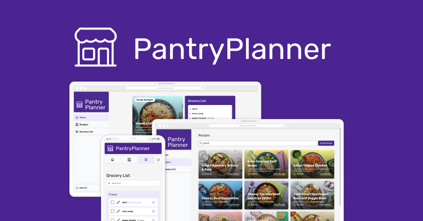

# PantryPlanner

**Project Description:** PantryPlanner is designed to simplify meal planning by combining an intuitive system to organize your favorite recipes and a user-friendly grocery list manager. Whether you're planning your weekly meals or
keeping track of your shopping, PantryPlanner ensures that food planning is easy and enjoyable.

The app can be viewed at https://recipe-book-liart.vercel.app/. **The login page has test credentials autofilled to allow anyone to explore the app. Currently, there is no fully developed onboarding flow available.**



## Table of Contents

-   [Technologies](#Technologies)
-   [Features](#Features)
-   [Database](#Database)
-   [Contact](#Contact)

## Technologies

-   **Next.js 15 (Canary):** Using the cutting-edge features of Next.js 15, this project benefits from advanced capabilities like partial prerendering and Edge functions, enhancing both performance and scalability.

-   **React Features:** This project incorporates React's latest advancements, including server components, form actions, Suspense, transitions, and the useOptimistic hook.

-   **Tailwind CSS:** Employed for styling with a utility-first approach. Tailwind CSS allows all UI elements to be customized and designed from scratch, resulting in a unique and visually appealing app.

-   **Nutritionix API:** Powers the grocery list feature with intelligent autocomplete suggestions. This integration simplifies item addition, improving the user experience by making it faster and more intuitive.

-   **Zod:** Provides advanced form validation capabilities, ensuring reliable data entry and processing. Zod helps maintain high data quality and user input accuracy.

-   **Vercel:** Used for application deployment, database hosting, and image hosting. Vercel optimizes performance with built-in support for Next.js features.

-   **[PostgreSQL](#Database)**

## Features

-   **Searchable Infinite Scroll:** The `/recipes` page features an infinite scroll feature which improves the data loading experience. Users can search results by title, description, or ingredient to quickly find relevant recipes.

-   **Responsive & Beautiful Styling:** Designed with aesthetics and usability in mind, this app offers a fully responsive experience across mobile devices. Optimistic updates and skeleton Suspense components ensure that the UI is smooth and responsive to user interactions.

-   **Home Page:** The default `/home` page showcases a recipe spotlight, a shortcut for recipe creation, and a quick glance at the grocery list. These elements are designed to provide easy access to core functionalities and improve user engagement.

-   **Smart & Flexible Grocery List:** The grocery list includes a smart autocomplete feature powered by the Nutritionix API for convenient item addition. Users can also add custom items, check and uncheck items, reorder them, and include quantities and comments for better list management.

-   **Authentication:** The app requires authentication for all routes except `/` and `/login`. User credentials are securely managed with hashed passwords and standard security practices. Future plans include implementing Single Sign-On (SSO) for improved user convenience.

-   **Form Validation:** Zod and React form actions are used to ensure robust server-side data validation and provide real-time feedback to users.

## Database

The project uses PostgreSQL for data management. I chose to implement database interactions using raw SQL queries to enhance my understanding of database operations, given that my previous experience mostly involved external service integrations like Prisma.

**Database Schema:**

```
TABLE users (
    id uuid DEFAULT uuid_generate_v4() PRIMARY KEY,
    name character varying(255) NOT NULL,
    email text NOT NULL,
    password text NOT NULL,
    created_at timestamp with time zone DEFAULT CURRENT_TIMESTAMP
);

TABLE recipes (
    id uuid DEFAULT uuid_generate_v4() PRIMARY KEY,
    user_id uuid REFERENCES users(id) ON DELETE CASCADE,
    title character varying(255) NOT NULL,
    image text,
    description text,
    servings integer,
    prep_time_hours integer DEFAULT 0,
    prep_time_minutes integer DEFAULT 0,
    cook_time_hours integer DEFAULT 0,
    cook_time_minutes integer DEFAULT 0,
    created_at timestamp with time zone DEFAULT CURRENT_TIMESTAMP
);

TABLE ingredients (
    id uuid DEFAULT uuid_generate_v4() PRIMARY KEY,
    recipe_id uuid REFERENCES recipes(id) ON DELETE CASCADE,
    name character varying(255) NOT NULL,
    quantity character varying(50),
    comment text
    created_at timestamp with time zone DEFAULT CURRENT_TIMESTAMP,
);

TABLE instructions (
    id uuid DEFAULT uuid_generate_v4() PRIMARY KEY,
    recipe_id uuid REFERENCES recipes(id) ON DELETE CASCADE,
    step_number integer NOT NULL,
    instruction text NOT NULL,
    created_at timestamp with time zone DEFAULT CURRENT_TIMESTAMP
);

-- For now each user has a single grocery_list - this table was created for a future where there can be many
TABLE grocery_lists (
    id uuid DEFAULT uuid_generate_v4() PRIMARY KEY,
    user_id uuid REFERENCES users(id) ON DELETE CASCADE,
    name character varying(255) NOT NULL,
    created_at timestamp with time zone DEFAULT CURRENT_TIMESTAMP
);

TABLE grocery_items (
    id uuid DEFAULT uuid_generate_v4() PRIMARY KEY,
    grocery_list_id uuid REFERENCES grocery_lists(id) ON DELETE CASCADE,
    name character varying(255) NOT NULL,
    quantity character varying(50),
    comment text
    checked boolean,
    image text,
    sort_order integer,
    created_at timestamp with time zone DEFAULT CURRENT_TIMESTAMP,
);
```

## Contact

-   Lindsay Toffolo: lindsaytoffolo@gmail.com
-   LinkedIn: https://www.linkedin.com/in/lindsaytoffolo/
-   GitHub: https://github.com/lindsaytoffolo
